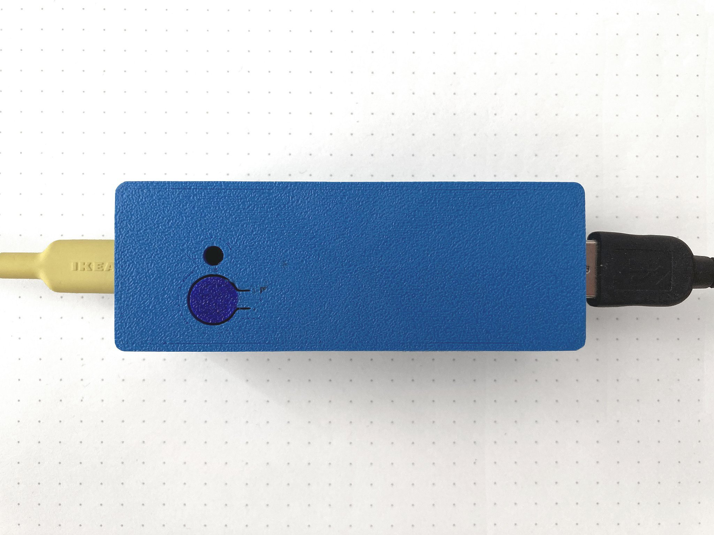
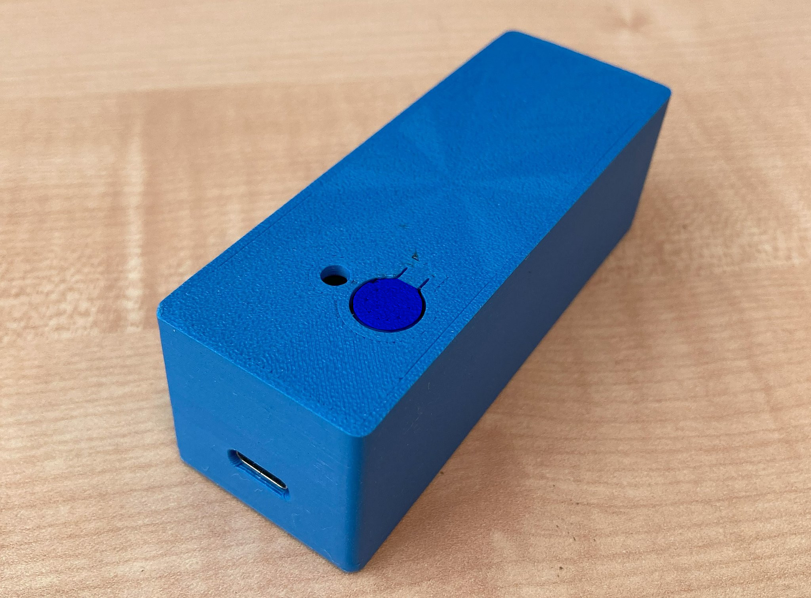

# MUSMET MIDI Bridge
(**MUS**ical **MET**averse **MIDI** **Bridge**)

Hardware and software solution that lets you use your MIDI devices in a _**Musical Metaverse**_. Connect any class-compliant MIDI device and map its MIDI input into OSC messages. 
These OSC messages can then be sent to a VR/XR musical ecosystem (e.g., PatchWorld) or other compatible platforms.

## Features

- **MIDI Host Functionality**: Connect any class-compliant MIDI device to the Bridge.
- **OSC Message Mapping**: Translate MIDI input into OSC messages for seamless integration with PatchWorld or any other musical metaverse ecosystem.
- **Customizable Mapping**: Modify the MIDI-to-OSC mapping to suit your specific needs.

## Hardware
The Bridge's hardware consists of the following components:

- **Raspberry Pi Pico W**: Serves both as the MIDI host and as the OSC client, handling communication and processing.
- **USB-to-microUSB adapter**: USB-A cables are the most common.
- **Push button**: Used to reset the Pico W and enter WiFi config mode.
- **5V power supply**: Powers the Pico W and the connected MIDI device. The Pico W can't be powered through the USB port as it is used for MIDI communication. The power supply must be able to provide enough current for connected MIDI devices.

## Software

### Arduino Dependencies:
- [Arduino-Pico](https://github.com/earlephilhower/arduino-pico)
- [OSC](https://github.com/CNMAT/OSC)
- [EZ_USB_MIDI_HOST](https://github.com/rppicomidi/EZ_USB_MIDI_HOST)

### IDE Settings

## Debugging
To debug the project and view serial messages, you will need a DebugProbe (you can also use a Pico as a PicoProbe).

## MIDI-to-OSC Default Mapping Table
In this project we split the values of MIDI data1 and data2 into two distinct OSC messages. 
You can easily modify the code to customize the mapping.

| MIDI Message               | Description                                        | Mapped | First OSC Message          | Second OSC Message         |
|---------------------------|----------------------------------------------------|-----------|--------------------------|----------------------------|
| Note On                   | Trigger notes                                      | ✅        | /ch{channel}note {pitch} | /ch{channel}nvalue {velocity}     |
| Note Off                  | Release notes                                      | ✅        | /ch{channel}noteoff {pitch}  | /ch{channel}noteoff {velocity}|
| Control Changes (CC)      | Modify parameters such as volume, pan, modulation  | ✅        | /ch{channel}cc {controller} | /ch{channel}ccvalue {value}   |
| Pitch Bending             | Adjust pitch dynamically                           | ✅        | /ch{channel}pitch {value}  | -                |
| Aftertouch                | Respond to pressure after keys are pressed         | ✅        | /ch{channel}pressure {value} | -                |
| Program Change            | Switch instrument or patch presets                 | ❌        | -                     | -                         |
| System Exclusive (SysEx)  | Manufacturer-specific messages                     | ❌        | -                     | -                         |
| MIDI Time Code (MTC)      | Synchronize playback with other devices            | ❌        | -                     | -                         |
| Polyphonic Aftertouch     | Individual pressure sensitivity for each note      | ❌        | -                     | -                         |
| Song Select               | Choose a specific song in a sequence               | ❌        | -                     | -                         |
| Song Position Pointer     | Indicate a specific position in a song             | ❌        | -                     | -                         |
| System Real-Time Messages | Clock, start, stop, continue for synchronization   | ❌        | -                     | -                         |
