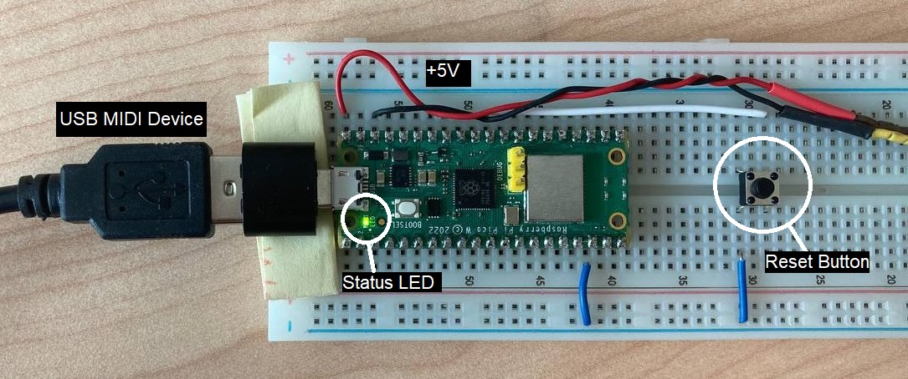
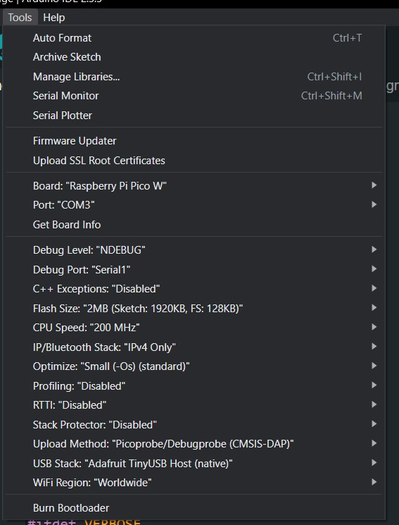

# MUSMET MIDI Bridge
(**MUS**ical **MET**averse **MIDI** **Bridge**)

Hardware and software solution that lets you use your MIDI devices in a _**Musical Metaverse**_. Connect any class-compliant MIDI device and map its MIDI input into OSC messages. 
These OSC messages can then be sent to a VR/XR musical ecosystem (e.g., PatchWorld) or other compatible platforms.

## Hardware
The Bridge's hardware consists of the following components:

- **Raspberry Pi Pico W**: Serves both as the MIDI host and as the OSC client, handling communication and processing.
- **USB-to-microUSB adapter**: USB-A cables are the most common.
- **Push button**: Used to reset the Pico W and enter WiFi config mode.
- **5V power supply**: Powers the Pico W and the connected MIDI device. The Pico W can't be powered through the USB port as it is used for MIDI communication. The power supply must be able to provide enough current for the connected MIDI device ().

## Software

### Arduino Dependencies:
- [Arduino-Pico](https://github.com/earlephilhower/arduino-pico)
- [OSC](https://github.com/CNMAT/OSC)
- [EZ_USB_MIDI_HOST](https://github.com/rppicomidi/EZ_USB_MIDI_HOST)

### IDE Settings

## Features

- **MIDI Host Functionality**: Connect any class-compliant MIDI device to the *pico*Bridge.
- **OSC Message Mapping**: Translate MIDI input into OSC messages for seamless integration with PatchWorld or any other musical metaverse ecosystem.
- **Customizable Mapping**: Modify the MIDI-to-OSC mapping to suit your specific needs.

## Debugging
To debug the project and view serial messages, you will need a DebugProbe (you can also use a Pico as a PicoProbe).

## MIDI2OSC Mapping

- ✅ **Note On**: Trigger notes (_/note{channel} ({pitch}, {velocity})_, for example: `/note1 (60, 80)`).
- ✅ **Note Off**: Release notes (_/noteoff{channel} ({pitch}, {zero_velocity})_, for example: `/noteoff1 (60, 0)`).
- ✅ **Pitch Bending**: Adjust pitch dynamically (_/pitch{channel} ({value},)_, for example: `/pitch4 (7249,)`).
- ✅ **Control Changes (CC)**: Modify parameters such as volume, pan, or modulation (_/cc{channel} ({controller}, {value})_, for example: `/cc3 (13, 120)`).
- ✅ **Aftertouch**: Respond to pressure applied to keys after they are pressed (_/after{channel} ({value},)_, for example: `/after4 (40,)`).

- ❌ **Program Change**: Switch instrument or patch presets.
- ❌ **System Exclusive (SysEx)**: Manufacturer-specific messages for advanced device control.
- ❌ **MIDI Time Code (MTC)**: Synchronize playback with other devices.
- ❌ **Polyphonic Aftertouch**: Individual pressure sensitivity for each note.
- ❌ **Song Select**: Choose a specific song in a sequence.
- ❌ **Song Position Pointer**: Indicate a specific position in a song for playback.
- ❌ **System Real-Time Messages**: Clock, start, stop, and continue for synchronization.
